<h1 align="center">Diable Launcher</h1>

<p align="center">
  <b>A fast, minimal, one-handed Android launcher — free, open source, and private by design.</b>
</p>

<p align="center">
  <a href="LICENSE"></a>
  
  
  
  <a href="https://github.com/Ankitsaroj94/diable_launcher/pulls"></a>
</p>

<p align="center">
  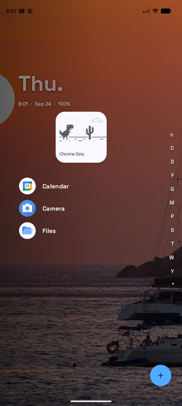
  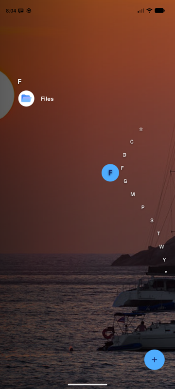
  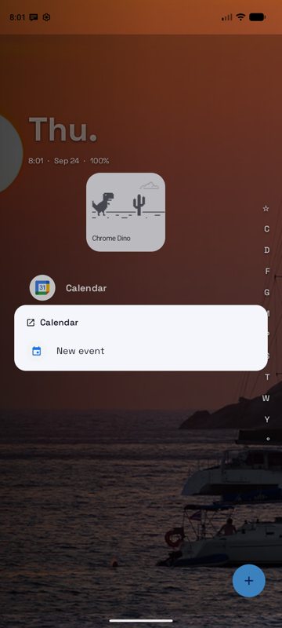
  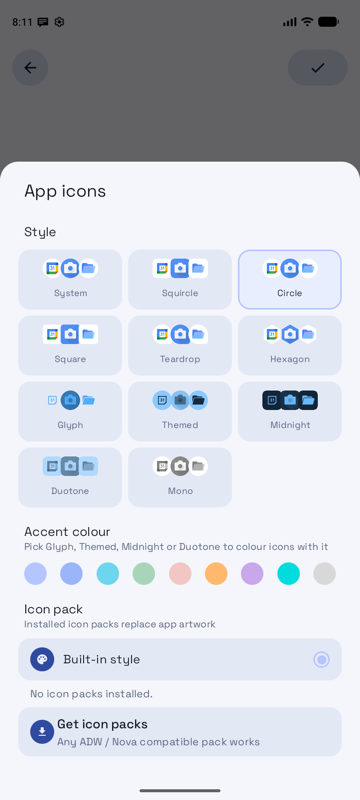
</p>

---

## Why Diable exists

Most home screens are grids of icons that pull you into apps you didn't mean to open.
Diable takes the opposite approach: **one calm list**, reachable with your thumb, that
shows your favorites and gets out of the way.

It exists because a launcher is the most personal app on a phone, and it should be:

- **Yours.** No account, no sign-in, no ads, no analytics, and no paywall. Every feature is
  free, including the ones other launchers put behind a subscription.
- **Private.** It never collects or uploads anything about you. The only network requests
  are for wallpapers and weather, and only when you use those features (see
  [Privacy](#privacy)).
- **Fast.** A launcher is always running. Diable is built to stay light: no polling, no
  background work while it's hidden, and an idle CPU cost of well under 1%.
- **Open.** You can read every line, change what you don't like, and ship your own build.
  Launchers are a great way to learn modern Android, and this codebase is meant to be
  approachable.

## Features

**Home and navigation**
- One continuous list: clock and favorites at the top, every app A–Z below, and a
  "Diable Launcher" footer with *Recently installed* and settings
- Curved **alphabet scrubber** on the right edge: drag to preview a letter's apps, release to
  jump; tap a letter to jump; double-tap to lock the screen (*Quick Lock*)
- Swipe up for search, swipe down for notifications, Home toggles search, Back never leaves
  the launcher
- The **Diable button**: set your own tap and swipe-up actions

**Apps**
- Tap or swipe left to open; **swipe right** for a pop-up with the app's shortcuts,
  notifications, inline **quick replies**, pinned apps and an optional **pop-up widget**
- **Long-press menu**: favorite, app info, screen time, categories, hide, uninstall,
  rename, change icon
- **Notification dots** with a one-line preview under the app name
- **Pop-up folders** in your favorites; hide apps; drag to reorder favorites

**Widgets**
- Any Android widget, with its setup screen, move and resize controls and fill-screen mode
- **Widget stacks**: swipe sideways between several widgets in one slot

**Search**
- Word-prefix matching, Enter opens the top result, last result and recently installed
  apps
- Built-in **calculator** (functions, constants, implied multiplication), contact search
  with a call button, optional web suggestions from the provider you choose

**Personalisation**
- 11 built-in **icon styles** that follow your accent colour, plus any ADW/Nova-compatible
  **icon pack**, per app if you like
- Fonts, font size, text colour, theme colours (including Material You), **light and dark**
  themes, pitch black, many clock styles
- Wallpapers from [Openverse](https://openverse.org) with creator credits, or your own
  photos
- Ready-made themes, saving your own, and sharing or importing themes as text

**Digital wellbeing**
- **Usage Breaker** reminds you to take a break from the apps you choose
- **Notification Summary** holds non-urgent notifications until set times of day (messages,
  calls and alarms always come through)

## Screenshots

| Home | Alphabet | All apps | Swipe right |
|:---:|:---:|:---:|:---:|
|  |  | 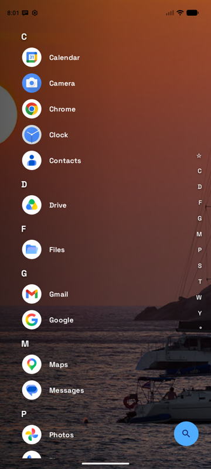 |  |

| App menu | Search | Calculator | Settings |
|:---:|:---:|:---:|:---:|
| 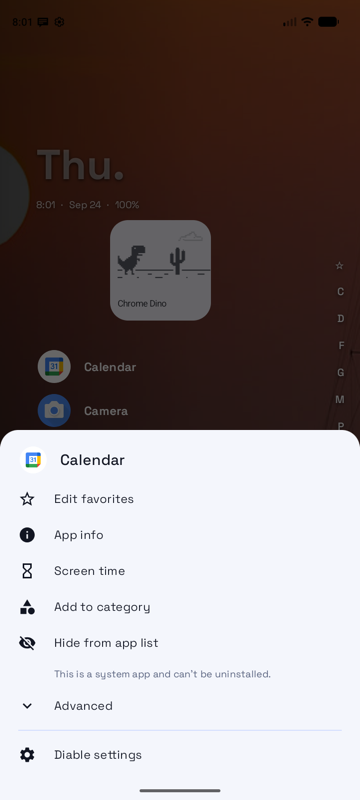 | 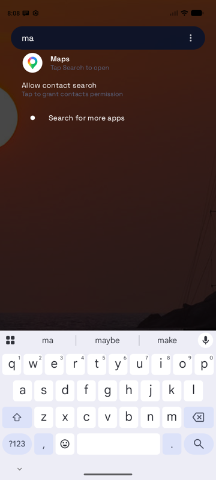 | 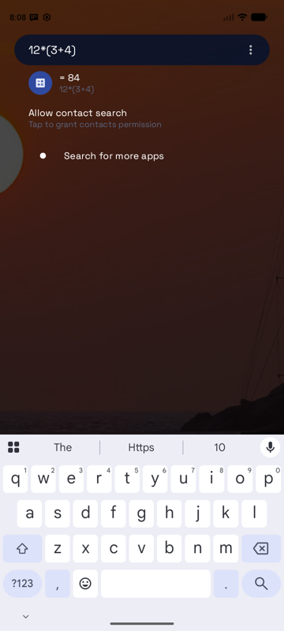 | 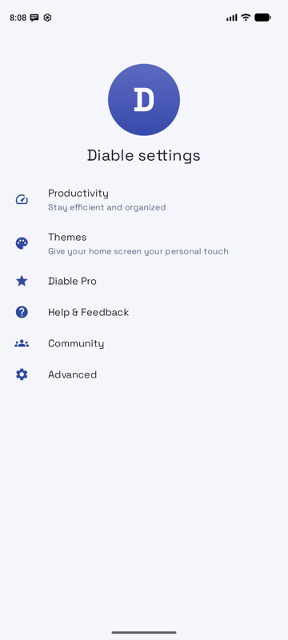 |

| Productivity | Theme editor | Theme editor (dark) | Icon styles |
|:---:|:---:|:---:|:---:|
| 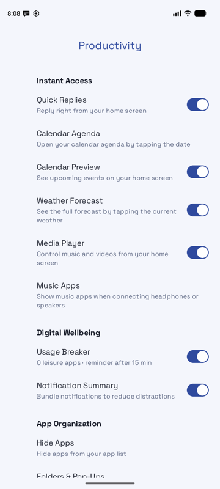 | 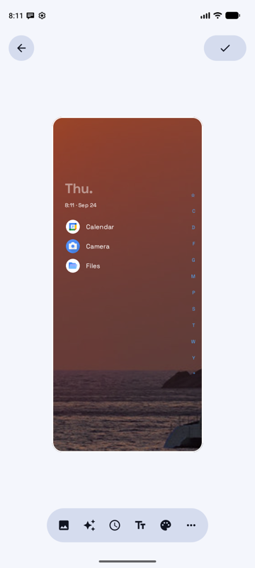 | 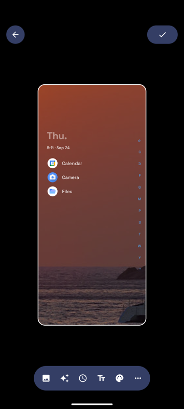 |  |

## Getting started

### Install from source
Requirements: Android Studio (or the Android SDK command-line tools) and JDK 17+.

```bash
git clone https://github.com/Ankitsaroj94/diable_launcher.git
cd diable_launcher
./gradlew assembleDebug
adb install -r app/build/outputs/apk/debug/app-debug.apk
```

Then press Home and choose **Diable Launcher**, or set it from the command line:

```bash
adb shell cmd package set-home-activity in.ankitsaroj.diable/.MainActivity
```

### Optional access
Some features use special access that Android only grants in system settings. Diable asks
when you turn on a feature that needs it:

| Access | Used for |
|---|---|
| Notification access | Notification dots, media player, quick replies, Notification Summary |
| Accessibility service | Quick Lock (locking the screen with a double tap). Reads no screen content |

## Privacy

Diable has **no account, no analytics, no ads and no crash reporting**. Your settings stay
on your device and are only exported when you create a backup yourself.

The app only talks to the network for these features:

| Service | When | What is sent |
|---|---|---|
| [Openverse](https://openverse.org) | Browsing wallpapers | Your search term |
| [Open-Meteo](https://open-meteo.com) | Weather is on | Coordinates of your chosen city or approximate location |
| Open-Meteo geocoding | Searching for a weather city | The city name you type |
| Your chosen search provider | Web suggestions are on (off by default) | What you type in search |

<details>
<summary>Android permissions and why they're needed</summary>

| Permission | Why |
|---|---|
| `QUERY_ALL_PACKAGES` | A launcher has to list every installed app |
| `INTERNET` | Wallpapers, weather and optional web suggestions |
| `READ_CONTACTS` | Contact search (off by default) |
| `READ_CALENDAR` | Upcoming events and the agenda |
| `ACCESS_COARSE_LOCATION` / `ACCESS_FINE_LOCATION` | Weather for your location, if you don't pick a city |
| `POST_NOTIFICATIONS` | Usage Breaker reminders |
| `SET_WALLPAPER` | Applying a wallpaper |
| `READ_MEDIA_IMAGES` / `READ_EXTERNAL_STORAGE` | Choosing a wallpaper from your photos on older Android versions |
| `VIBRATE` | Haptic feedback |
| `REQUEST_DELETE_PACKAGES` | The *Uninstall* item in the app menu |
| `EXPAND_STATUS_BAR` | Swipe down to open notifications |

</details>

## How it's built

Diable is a single-module Android app written in **Kotlin** with **Jetpack Compose**.

```
app/src/main/java/in/ankitsaroj/diable/
├── data/          App list, prefs (DataStore), icon packs, wallpapers, weather, calendar, media
├── service/       Notification listener (dots, media, replies, summary), accessibility (Quick Lock)
├── navigation/    Compose navigation graph and routes
└── ui/
    ├── home/      Clock, widgets and widget stacks, pop-ups and app menus, the Diable button
    ├── screens/   Home, search, settings, themes, favorites, folders, agenda
    ├── components/ Alphabet scrubber, icon renderer, sheets, settings rows
    └── theme/     Colours (light/dark), typography, fonts
```

A few principles keep it fast. Please follow them in contributions:
- **Load once, push updates.** The app list is one process-wide `StateFlow`, refreshed by
  `LauncherApps` callbacks. Never build a new `Flow` inside composition.
- **Never poll.** Media, notifications and packages are all event-driven.
- **Stay idle when hidden.** The clock ticks once a minute and only while visible.
- **Render icons once.** Icons are drawn off the main thread into a shared cache.
- **Save through the repository.** Pref writes from sheets and dialogs use
  `PrefsRepository.launchUpdate`, which outlives the screen that made the change.

Libraries: AndroidX (Compose, Material 3, Navigation, DataStore, Lifecycle), Coil for
images and Accompanist Drawable Painter. Bundled fonts are licensed under the SIL Open Font
License.

## Contributing

Contributions are very welcome: bug reports, ideas, translations, docs and code.

1. **Open an issue** first for anything bigger than a small fix, so we can agree on the
   approach.
2. Fork the repo and create a branch: `git checkout -b feature/my-change`.
3. Keep the code style of the surrounding files and the performance principles above.
4. Build and try your change on a device or emulator: `./gradlew assembleDebug`.
5. Open a pull request describing **what** changed, **why**, and how you tested it.
   Screenshots help for UI changes.

Good first contributions:
- Translating the app's strings
- Accessibility improvements (labels, contrast, TalkBack)
- More built-in icon styles or clock faces
- Tests for the calculator (`util/MathEval.kt`) and icon-pack parsing

## Roadmap

- [ ] Localisation (strings are currently English only)
- [ ] F-Droid release
- [ ] Per-app notification filtering for Notification Summary
- [ ] Hourly weather forecast inside the launcher
- [ ] Tablet and landscape layouts

## License

Diable Launcher is released under the [Apache License 2.0](LICENSE). You're free to use,
modify and distribute it, including in your own projects, as long as you keep the licence
and notices.
